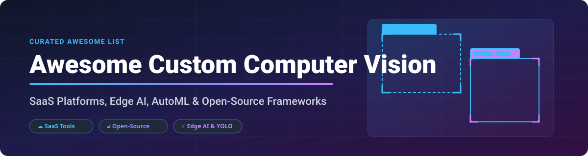

  

# 👁️ Awesome Custom Computer Vision 🚀

  
  
  
  
  

---

## 📌 Curated List of Custom Computer Vision SaaS Products & Open-Source Tools 💡

*Focused on Custom Model Training, Object Detection, Dataset Annotation, AutoML & Edge AI Deployment Workflows*

**Last updated: October 2026**

This repository tracks top **SaaS platforms** and **open-source GitHub projects** for **Custom Computer Vision**. These tools empower developers, machine learning engineers, and businesses to build, annotate, and train custom object detection, image classification, and instance segmentation models on proprietary datasets without needing complex ML infrastructure setup.

---

## 📖 Table of Contents 🔍

- [☁️ SaaS/Hosted Platforms](#️-saashosted-platforms)
- [🔓 Open-Source GitHub Projects](#-open-source-github-projects)
- [🤝 How to Contribute](#-how-to-contribute)
- [☕ Support & Community](#-support--community)
- [📈 Star History](#-star-history)
- [⚠️ Disclaimer](#️-disclaimer)

---

## ☁️ SaaS/Hosted Platforms 🌐

> **📊 Market Size & Dynamics**: The global custom computer vision market is estimated at **~$8B in 2026**, projected to grow to **~$25B by 2032** at a **~21% CAGR**. The sector is **moderately fragmented** — tech giants like Amazon, Google, and Microsoft offer custom vision bundled into cloud ecosystems, while specialized vendors (Roboflow, Ultralytics HUB, Landing AI, Edge Impulse) compete aggressively on annotation tools, developer experience, and edge deployment efficiency.
> 
> **⚠️ Critical Lifecycle Notice**: Microsoft has announced plans to **retire Azure Custom Vision**, with full support ending on **September 25, 2028**.

| Platform | Description | Pricing (Starting Tier) | Free Tier Limits | Company Size / Revenue / Valuation |
|:---|:---|:---|:---|:---|
| **[AWS Rekognition Custom Labels](https://aws.amazon.com/rekognition/custom-labels/)** | AWS custom object detection & scene classification. | **$1.00/hour** for training & **$4.00/hour** for inference | **2 free training hours/month** + **1 free inference hour/month** (12-month trial) | **~$638B revenue** (Amazon FY2025) |
| **[Google Cloud AutoML Vision](https://cloud.google.com/vision)** | Google Vertex AI custom vision training & image processing. | **$3.15/hour** for training node usage | **1,000 free operations/month** + **$300 new user GCP credits** | **~$350B revenue** (Alphabet FY2025) |
| **[Microsoft Custom Vision](https://azure.microsoft.com/en-us/services/cognitive-services/custom-vision-service/)** | **Retiring Sept 25, 2028.** Azure's custom image classification service. | **$2.00 per 1,000 transactions** (Standard S0 tier) | **F0 Free Tier**: 2 projects, 5,000 training images/project, **10,000 predictions/month** | **~$281B revenue** (Microsoft FY2025) |
| **[Clarifai](https://www.clarifai.com/)** | AI platform for computer vision, custom model training, and LLMs. | **$1.20/month** usage-based baseline | **Free Account**: 1,000 free operations + **1,000 free image inputs/month** | **~$100M+ valuation** (Private) |
| **[Roboflow](https://roboflow.com/)** | End-to-end CV platform for labeling, model training, and web/edge APIs. | **$249/month** (Starter Plan) | **Core Free Tier**: **10 credits/month** (~30 trainings or 80k RF-DETR inferences) | **~$80M+ valuation** (Private) |
| **[Edge Impulse](https://www.edgeimpulse.com/)** | Edge AI & AutoML platform for deploying custom CV on microcontrollers. | **$39/month** (Enterprise developer seat add-on) | **Developer Free Plan**: GPU access, 60-min jobs, **3 private projects**, up to 3 collaborators | **~$50M+ valuation** (Private) |
| **[V7](https://www.v7labs.com/)** | V7 Darwin automated image/video dataset annotation and model training. | **$119/month** (Starter Plan) | **14-day free trial** with 1,000 auto-annotation credits | **~$50M+ valuation** (Private) |
| **[AlwaysAI](https://alwaysai.co/)** | Edge AI development platform with EdgeIQ Python library. | **$99/month** (Developer Plan) | **14-day free trial** with 1 local edge deployment slot | **~$50M+ valuation** (Private) |
| **[Ultralytics HUB](https://hub.ultralytics.com/)** | Cloud platform for YOLO model training, dataset sync, and deployment. | **$29/month** (Pro Plan) | **Free Plan**: Unlimited projects, **100 models**, 100GB storage, $5-$25 signup credits | **~$20M+ valuation** (Private) |
| **[Landing AI](https://landing.ai/)** | LandingLens & Agentic Document Extraction for domain-specific vision. | **$19/month** (Pay-as-you-go Plan) | **Explore Free Plan**: **1,000 free credits** (valid for 90 days) | **Private** (Andrew Ng-backed) |

---

## 🔓 Open-Source GitHub Projects ⚡

Sorted by Stars_Count (descending). Stars_Badge links directly to each repo's stargazers page.

| Repo | Description | Stars_Badge | Stars_Count |
|:---|:---|:---:|:---:|
| **[Ultralytics YOLO](https://github.com/ultralytics/ultralytics)** | Industry-standard real-time object detection, segmentation & pose estimation framework (YOLOv8/v11/v12). |  | ~35,000 |
| **[Label Studio](https://github.com/HumanSignal/label-studio)** | Multi-modal data labeling tool for image classification, bounding boxes, segmentation, audio, and text. |  | ~22,500 |
| **[CVAT](https://github.com/cvat-ai/cvat)** | Computer Vision Annotation Tool — digital image and video annotation platform with automatic AI labeling. |  | ~15,000 |
| **[Detectron2](https://github.com/facebookresearch/detectron2)** | Meta AI's next-generation research platform for object detection and instance segmentation algorithms. |  | ~29,000 |
| **[MMDetection](https://github.com/open-mmlab/mmdetection)** | OpenMMLab's modular object detection toolbox supporting 50+ computer vision detection algorithms. |  | ~28,000 |
| **[FiftyOne](https://github.com/voxel51/fiftyone)** | Open-source tool for building high-quality computer vision datasets and visualizing model predictions. |  | ~9,500 |
| **[Weights & Biases](https://github.com/wandb/wandb)** | ML experiment tracking, dataset versioning, model registry, and evaluation framework for computer vision. |  | ~10,000 |
| **[Roboflow Inference](https://github.com/roboflow/inference)** | Self-hosted production inference server for deploying vision models (YOLO, SAM, RF-DETR) locally or on cloud. |  | ~2,000 |
| **[NN-GPT](https://github.com/ABrain-One/NN-GPT)** | LLM-driven AutoML for neural network code generation and training automation (CVPR 2026). |  | ~1,000 |
| **[Visionset](https://github.com/visionset/visionset)** | Computer vision dataset management, schema creation, annotation export, and MCP server for AI agents. |  | ~500 |
| **[AndroGen](https://github.com/AndroGen/AndroGen)** | Open-source synthetic data generator for computer vision model training and domain-specific dataset generation. |  | ~100 |

---

## 🤝 How to Contribute 🛠️

Contributions are warmly welcome! Help us expand and maintain this list of custom computer vision tools:

1. **Fork** this repository.
2. Add or update entries in `README.md` following the exact table structure.
3. Ensure links, pricing, and GitHub Stars_Count badges are accurate.
4. Open a **Pull Request** with a descriptive title.

Check out our curated list of awesome lists: [Awesome-Awesome-Awesome](https://github.com/ishandutta2007/Awesome-Awesome-Awesome) 🌟

---

## ☕ Support & Community ❤️

If this repository helped you find the right custom vision platform or open-source tool, please consider starring ⭐, sharing, or supporting the project!

- ⭐ **Star this repository** to help others discover it.
- 🔄 **Fork & Share** with fellow ML developers & computer vision engineers.
- 💬 Join our developer discussions on **[Discord](https://discord.gg/jc4xtF58Ve)**.
- ☕ **Sponsor & Buy a Coffee**: If you'd like to support ongoing open-source curation, visit the [GitHub Sponsor Dashboard](https://github.com/sponsors/ishandutta2007).

Thank you for your support! 🚀

---

## 📈 Star History 📊

---

## ⚠️ Disclaimer 📜

- This repository is community-curated for informational purposes only and does not constitute an endorsement.
- All product names, logos, and brands are property of their respective owners.
- Pricing details, free tier limits, and corporate valuations are subject to change. Always verify terms on vendor websites.
